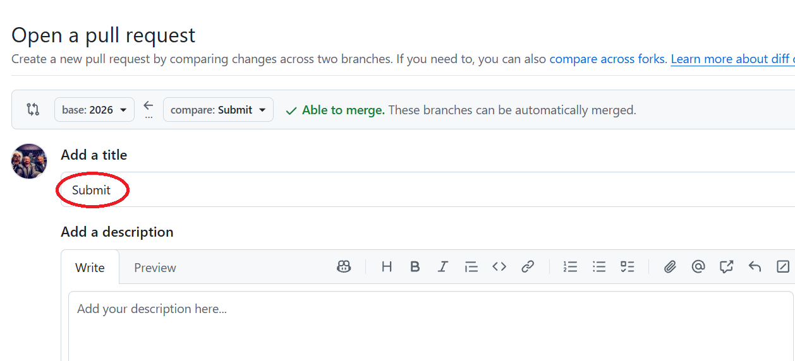

# Materials for NJCCZ Students

Welcome to **Materials for NJCCZ Students**! This repository is designed to store teaching and learning materials for H2 Computing and a little more. 

---

## Table of Contents
- [Submiting your solutions](#submitting-your-solutions)
- [List of Software Used](#list-of-software-used)
- [Using Github Codespaces](#using-github-codespaces)

---
## Submitting your solutions
 - forked this repo to your own githib account
 - Optional: create a branch in your forked repo
 - worked on your solutions in your own repo
 - Sync fork to get changes pushed to your fork
 - to submit your jupyter notebook solutions to the source repo, create a Pull Request (PR) with the keyword "Submit" (not case sensitive) in the **tite**. All modified files will be submitted.

## List of Software Used
1. Python 3.13.7, with:
   -  Flask 3.1.2
   -  JupyterLab 4.4.9
   -  Scikit-learn 1.7.2
   -  Matplotlib 3.10.6
   -  Pandas 2.3.3
2. DB Browser for SQLite 3.10.1
3. Notepad++ 7.5.4
[Download MOE software installer](https://go.gov.sg/h2computinginstall)

## Using Github Codespaces 
A Github codespace is a development environment that's hosted in the cloud. It has an Visual Studio Code IDE like interface that makes programming easier and more efficient. 

To learn on how to use them please visit [NJCCZ Repository](https://github.com/beertino/NJCCZ)
